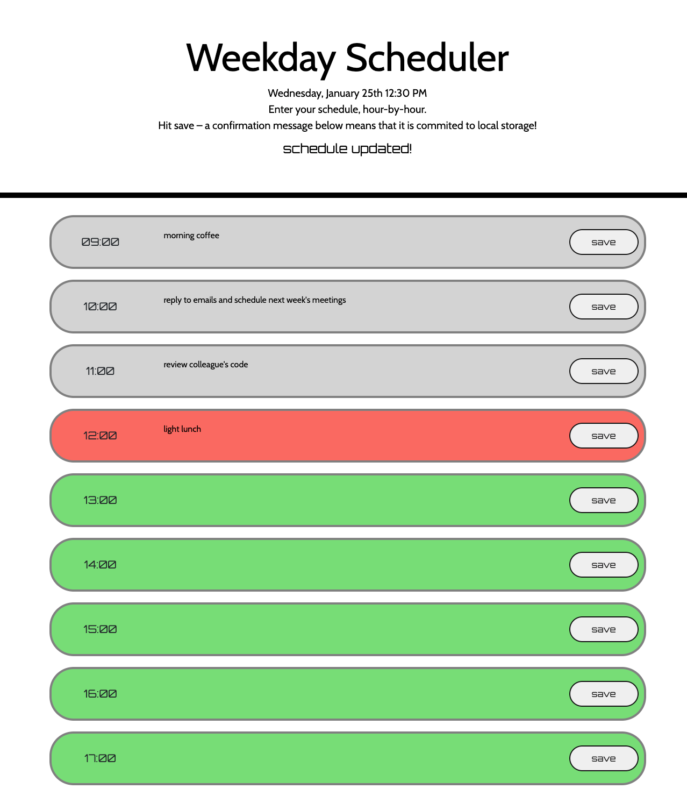

# weekday-planner

## Description
This is a simple web application that allows users to plan their schedule for the working hours of a weekday, with the ability to save their input to local storage and load it again when the page is refreshed. The app features a clear display of the current date and time, color-coding of time blocks based on the current time, and a confirmation message when input is saved locally, using local storage. The app can be used and viewed here: https://rararach-l.github.io/weekday-planner/

## Usage 
The app has one page, as shown in the screenshots below. The user can input their schedule for each hour of the day, and save it by clicking the corresponding save button. The current date and time are displayed at the top of the page, and the background color of each time block changes based on whether the hour has passed, is currently happening, or is in the future.

## Credits
This program was created following classes on front end development via trilogy eduction.

## License
Please refer to the LICENCE in the repo.
